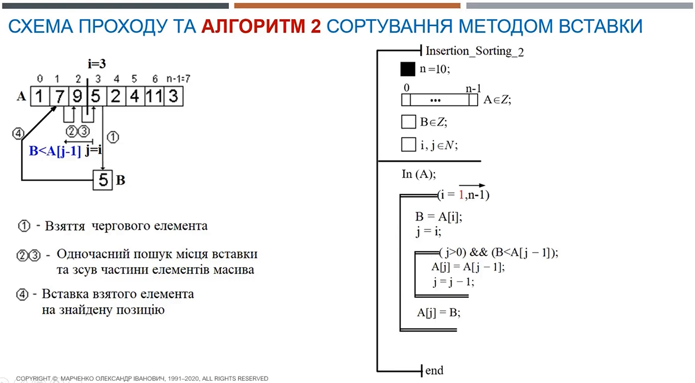

<p align="center"><b>МОНУ НТУУ КПІ ім. Ігоря Сікорського ФПМ СПіСКС</b></p>
<p align="center">
<b>Звіт з лабораторної роботи 3</b><br/>
"Конструктивний та деструктивний підходи до роботи зі списками"<br/>
дисципліни "Вступ до функціонального програмування"
</p>
<p align="right"><b>Студент:</b> <i>Горбуль Андрій Олександрович КВ-11</i><p>
<p align="right"><b>Рік:</b> <i>2024</i><p>

## Загальне завдання
Реалізуйте алгоритм сортування чисел у списку двома способами: функціонально і
імперативно.
1. Функціональний варіант реалізації має базуватись на використанні рекурсії і
конструюванні нових списків щоразу, коли необхідно виконати зміну вхідного списку.
Не допускається використання: псевдо-функцій, деструктивних операцій, циклів,
функцій вищого порядку або функцій для роботи зі списками/послідовностями, що
використовуються як функції вищого порядку. Також реалізована функція не має
бути функціоналом (тобто приймати на вхід функції в якості аргументів).
2. Імперативний варіант реалізації має базуватись на використанні циклів і
деструктивних функцій (псевдофункцій). Не допускається використання функцій
вищого порядку або функцій для роботи зі списками/послідовностями, що
використовуються як функції вищого порядку. Тим не менш, оригінальний список
цей варіант реалізації також не має змінювати, тому перед виконанням
деструктивних змін варто застосувати функцію copy-list (в разі необхідності).
Також реалізована функція не має бути функціоналом (тобто приймати на вхід
функції в якості аргументів).
## Варіант 4
Алгоритм сортування вставкою №2 (з лінійним пошуком справа) за незменшенням.
<p align="center">

</p>

## Лістинг функції з використанням конструктивного підходу
```lisp
(defun insert (x lst)
"Insert 'x' into 'lst' before first smaller element"
  (cond ((null lst) (list x))
        ((>= x (car lst)) (cons x lst))
        (t (cons (car lst) (insert x (cdr lst))))
  )
)

(defun constructive-sort-helper (remaining sorted)
"Inserts values from 'remaining' into 'sorted' in descending order
 and returns reversed 'sorted' when all elements of 'remaining' used"
  (if (null remaining)
      (reverse sorted)
      (constructive-sort-helper (cdr remaining) (insert (car remaining) sorted))
  )
)

(defun constructive-sort (lst)
"Constructs sorted list by non-descending,
 using insertion sort, linear search from the right"
  (constructive-sort-helper lst '())
)
```
### Тестові набори та утиліти
```lisp
(defun check-constructive-sort (name input expected)
"Execute `constructive-sort' on `input',
 compare result with `expected' and print comparison status"
  (format t "Test ~a... ~:[FAILED~;passed~]~%"
    name (equal (constructive-sort input) expected) 
  )
)

(defun test-constructive-sort ()
  (check-constructive-sort "1" '(1 2 3 4 5) '(1 2 3 4 5))
  (check-constructive-sort "2" '(5 4 3 2 1) '(1 2 3 4 5))
  (check-constructive-sort "3" '(4 1 3 2 5) '(1 2 3 4 5))
  (check-constructive-sort "4" '(5 5 3 3 1) '(1 3 3 5 5))
  (check-constructive-sort "5" '(1 -1 2 -2 0 0) '(-2 -1 0 0 1 2))
  (check-constructive-sort "6" '() '())
)

(test-constructive-sort)
```
### Тестування
```bash
$ sbcl --script scripts/constructive-sort.lisp 
Test 1... passed
Test 2... passed
Test 3... passed
Test 4... passed
Test 5... passed
Test 6... passed
```
## Лістинг функції з використанням деструктивного підходу
```lisp
(defun destructive-sort (lst)
"Constructs sorted list by non-descending,
 using insertion sort, linear search from the right"
  (let ((sorted-lst (copy-list lst)))
    (loop for i from 1 below (list-length sorted-lst) do
      (let ((x (nth i sorted-lst)) (j i))
        (loop while (and (> j 0) (< x (nth (- j 1) sorted-lst))) do
          (setf (nth j sorted-lst) (nth (- j 1) sorted-lst))
          (decf j)
        )
        (setf (nth j sorted-lst) x)
      )
    )
    sorted-lst
  )
)
```
### Тестові набори та утиліти
```lisp
(defun check-destructive-sort (name input expected)
"Execute `destructive-sort' on `input',
 compare result with `expected' and print comparison status"
  (format t "Test ~a... ~:[FAILED~;passed~]~%"
    name (equal (destructive-sort input) expected) 
  )
)

(defun test-destructive-sort ()
  (check-destructive-sort "1" '(1 2 3 4 5) '(1 2 3 4 5))
  (check-destructive-sort "2" '(5 4 3 2 1) '(1 2 3 4 5))
  (check-destructive-sort "3" '(4 1 3 2 5) '(1 2 3 4 5))
  (check-destructive-sort "4" '(5 5 3 3 1) '(1 3 3 5 5))
  (check-destructive-sort "5" '(1 -1 2 -2 0 0) '(-2 -1 0 0 1 2))
  (check-destructive-sort "6" '() '())
)

(test-destructive-sort)
```
### Тестування
```bash
$ sbcl --script scripts/destructive-sort.lisp 
Test 1... passed
Test 2... passed
Test 3... passed
Test 4... passed
Test 5... passed
Test 6... passed
```