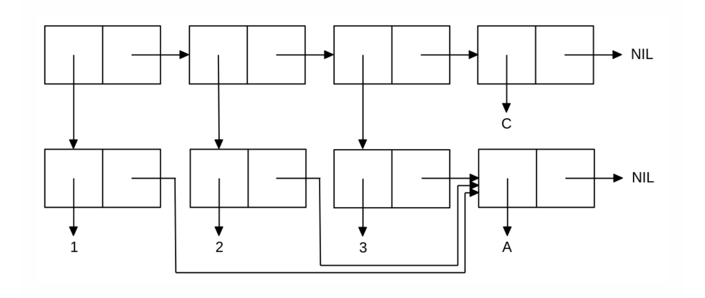

<p align="center"><b>МОНУ НТУУ КПІ ім. Ігоря Сікорського ФПМ СПіСКС</b></p>
<p align="center">
<b>Звіт з лабораторної роботи 1</b><br/>
"Обробка списків з використанням базових функцій"<br/>
дисципліни "Вступ до функціонального програмування"
</p>
<p align="right"><b>Студента</b>: <i>Горбуль А.О. КВ-11</i><p>
<p align="right"><b>Рік:</b> <i>2024</i><p>

## Загальне завдання
<!--лістинг пунктів загального завдання можна навести в одному блоці коду із коментарями,
які позначають початок виконання окремих пунктів, або ж розділити весь лістинг на окремі
блоки коду і додати для них підзаголовки (напр. ### Пункт 1)-->

```lisp
<тут має бути лістинг (текст) виконання загального завдання>
```

## Варіант 4
<p align="center">

</p>

```lisp
<тут має бути лістинг (текст) виконання завдання за варіантом>
```